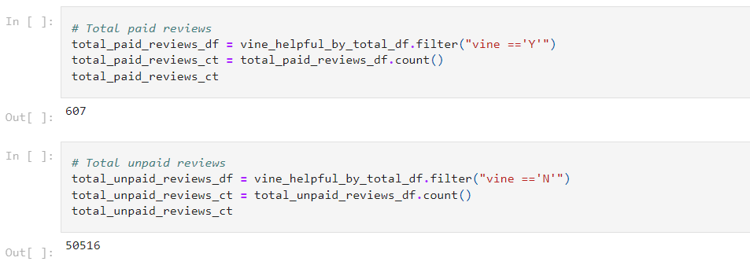
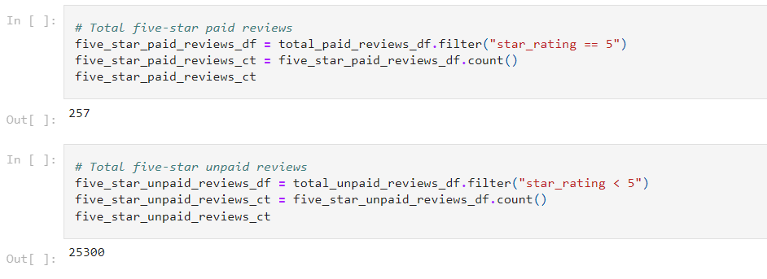
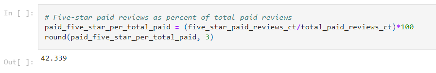
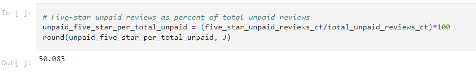

# Amazon Vine Analysis

## Overview of the Analysis
This project is about analyzing reviews written by the paid members of the Amazon Vine program (an amazon service that allows manufacturers and publishers to receive reviews for their products) using Amazon Web Services (AWS) Relational Data Service (RDS), postgresql, Google Colab and PySpark. The purpose of this project was to analyze review data and determine if there is any bias towards favorable reviews from the paid members in the available data.

There were 50 datasets of product categories available to chose from [Amazon Review Datasets](https://s3.amazonaws.com/amazon-reviews-pds/tsv/index.txt). Each one contains reviews of a specific product, from clothing apparel to wireless products. I chose to analyze reviews in the Camera category.

For the analysis, PySpark was used to extract the dataset, transform the data, connect to an AWS RDS instance, and load the transformed data into postrgresql pgAdmin. The complete program for the ETL (Extract-Transform-Load) can be found in the file, [Amazon_Reviews_ETL.ipynb](https://github.com/dshetty100/Amazon_Vine_Analysis/blob/main/Amazon_Reviews_ETL.ipynb), written using Google Colab. PySpark was also used to determine if there is any bias toward favorable reviews from Vine members in the chosen dataset. The complete program for this can be found in the file, [Vine_Reviews_Analysis.ipynb](https://github.com/dshetty100/Amazon_Vine_Analysis/blob/main/Vine_Review_Analysis.ipynb), written using Google Colab.

## Results

The available reviews from the chosen dataset was filtered to just those with more than 20 votes and those which were more than 50% "helpful."

Results of the calculation from the filtered dataset (also see, [Vine_Reviews_Analysis.ipynb](https://github.com/dshetty100/Amazon_Vine_Analysis/blob/main/Vine_Review_Analysis.ipynb) ) are shown below:

- Paid and Unpaid Reviews
\
There were 50,516 non-vine (unpaid) reviewers and 607 vine (paid) reviews.

- Five-star Paid and Unpaid Reviews
\
There were 25,300 non-vine (unpaid) 5-star reviewers and 257 vine (paid) 5-star reviewers.

- Five-star reviews as percent of paid reviews
\
Out of 607 total Vine (paid) reviews, 257 (42.3%) were 5-star reviews.

- Five-star reviews as percent of non-paid reviews
\
Out of 50,516 nob-vine (unpaid) reviews, 25,300 (50.08%) were 5-star reviews.

## Summary 
The above results shows that there is not enough evidence to suggest that there is a bias toward five-star reviews from paid Amazon Vine reviewers. To arrive at a definitive conclusion it would be useful to carry out similar analysis 
for the paid and unpaid reviews across a few different product categories.

